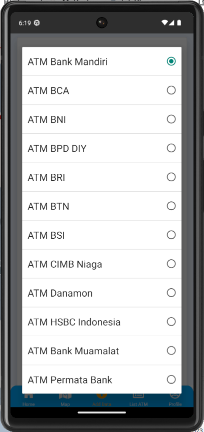
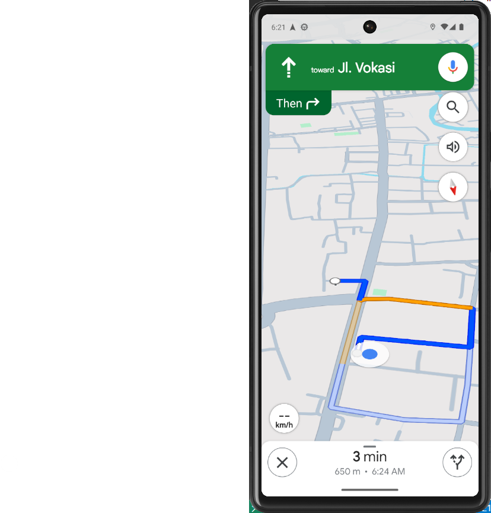

# ATMNearby

Aplikasi "ATM Nearby" adalah aplikasi yang dirancang untuk membantu
pengguna menemukan lokasi ATM terdekat dengan mudah. ATM Nearby
menyediakan beberapa fitur utama, seperti Informasi Persebaran Lokasi
ATM, Menambahkan Data Persebaran ATM, Navigasi ATM, dan Pencarian ATM.

## Komponen Aplikasi

1.  React native
2.  Javascript
3.  HTML
4.  LeafletJS
5.  Google Spreadsheets
6.  Apps Script
7.  FontAwesome5
8.  Github

### Sumber Data

Sumber data didapatkan dari:

1.  Hasil survei mandiri
2.  Google Maps

#### Demo Produk

